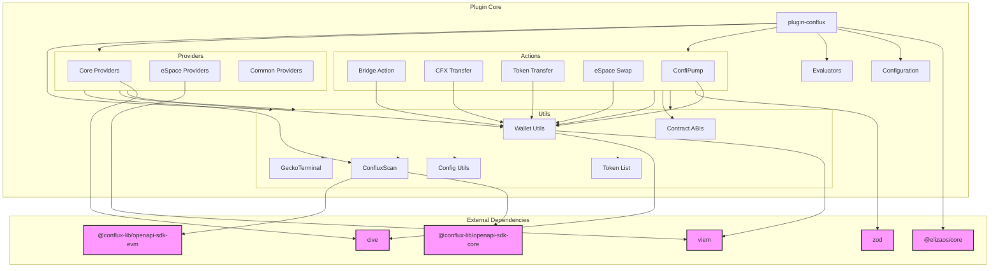

# Conflux Plugin Technical Documentation

## Table of Contents
1. [Environment Variables](#environment-variables)
2. [Architecture](#architecture)
3. [Function Listings](#function-listings)
4. [API Integrations](#api-integrations)

## Environment Variables

The Conflux plugin relies on several environment variables for configuration. The plugin's functionality is determined by the combination of these variables.

### Critical Variables
```env
# Required - Plugin will not activate without this
CONFLUX_TARGET=mainnet|testnet              # Network target for all operations
```

### Authentication Methods
```env
# Option 1: Mnemonic (enables both networks)
CONFLUX_MNEMONIC=<mnemonic>                 # Mnemonic phrase for key derivation

# Option 2: Individual Private Keys
CONFLUX_CORE_PRIVATE_KEY=<private-key>      # Private key for Core network
CONFLUX_ESPACE_PRIVATE_KEY=<private-key>    # Private key for eSpace network
```

### Network RPC URLs
```env
# Optional - Defaults to chain-specific RPC endpoints
CONFLUX_CORE_RPC_URL=<rpc-url>             # Custom RPC endpoint for Core network (defaults to cive chains)
CONFLUX_ESPACE_RPC_URL=<rpc-url>           # Custom RPC endpoint for eSpace network (defaults to viem chains)
```

### Default RPC Endpoints

#### Core Network (via `cive` chains)
- Mainnet: `https://main.confluxrpc.com`
- Testnet: `https://test.confluxrpc.com`

#### eSpace Network (via `viem` chains)
- Mainnet: `https://evm.confluxrpc.com`
- Testnet: `https://evmtestnet.confluxrpc.com`

### API Integration Variables
```env
# Optional - Falls back to rate-limited access
CONFLUX_CORE_CONFLUXSCAN_APIKEY=<api-key>   # API key for ConfluxScan Core
CONFLUX_ESPACE_CONFLUXSCAN_APIKEY=<api-key> # API key for ConfluxScan eSpace

# Optional - Custom API endpoints
CONFLUX_CORE_CONFLUXSCAN_HOST=<host>        # Custom ConfluxScan Core host
CONFLUX_ESPACE_CONFLUXSCAN_HOST=<host>      # Custom ConfluxScan eSpace host
```

### Feature Availability Matrix

| Configuration State | Available Features |
|--------------------|-------------------|
| No CONFLUX_TARGET | Plugin deactivated |
| CONFLUX_TARGET only | Read-only API access via ConfluxScan |
| + CONFLUX_MNEMONIC | All features on both networks using default chain RPCs |
| + CONFLUX_CORE_PRIVATE_KEY | Core network actions using cive default RPC |
| + CONFLUX_ESPACE_PRIVATE_KEY | eSpace network actions using viem default RPC |
| + Custom RPC URLs | Same features using custom RPC endpoints |

### Network-Specific Features

#### Core Network
- Transfer CFX/Tokens
- Bridge to eSpace
- Network statistics
- Account data

#### eSpace Network
- Transfer CFX/Tokens
- Token swaps
- Network statistics
- Account data

### Configuration Hierarchy

1. **Base Configuration**
   ```typescript
   if (!target || !["mainnet", "testnet"].includes(target)) {
       return null; // Plugin deactivates
   }
   ```

2. **Wallet Initialization**
   ```typescript
   // Priority: Private Key > Mnemonic
   if (privateKey) {
       initializeWithPrivateKey();
   } else if (mnemonic) {
       initializeWithDerivedKey();
   }
   ```

3. **Feature Activation**
   - ConfluxScan APIs initialize regardless of wallet availability
   - Token List Manager requires network target only
   - GeckoTerminal initializes for mainnet only
   - Transaction features require respective network wallet

### Configuration Notes

1. **Network Target**:
   - Required for any functionality
   - Must be either 'mainnet' or 'testnet'
   - Affects all components consistently

2. **Authentication Flexibility**:
   - Mnemonic activates both networks
   - Private keys can be used independently
   - Mix of mnemonic and private keys is supported

3. **API Access**:
   - ConfluxScan access available without wallets
   - API keys optional but recommended
   - Custom endpoints for special deployments

4. **Security Considerations**:
   - Never commit private keys or mnemonics
   - Use environment variables or secure secrets management
   - API keys should be properly secured

5. **Network Consistency**:
   - All components use the same network target
   - Cannot mix mainnet/testnet in the same instance
   - Bridge operations require Core wallet configuration

## Architecture

The Conflux plugin is structured into several key components:

### Core Components

```mermaid
graph TB
    subgraph ConfluxPlugin
        Plugin[ConfluxPlugin]
        Config[Config Validator]

        subgraph Actions
            ActionsManager[Actions Manager]
            Bridge[Bridge Action]
            CfxTransfer[CFX Transfer]
            TokenTransfer[Token Transfer]
            EspaceSwap[eSpace Swap]
            ConfiPump[ConfiPump]
        end

        subgraph Providers
            ProvidersManager[Providers Manager]

            subgraph Common
                Tokens[Tokens Provider]
                GeckoTerminal[GeckoTerminal Provider]
            end

            subgraph Core
                CoreWallet[Core Wallet]
                CoreMetrics[Core Metrics Providers]
            end

            s ubgraph ESpace
                ESpaceWallet[eSpace Wallet]
                ESpaceMetrics[eSpace Metrics Providers]
            end
        end

        subgraph Utils
            subgraph Wallet
                WalletCore[Core Wallet Utils]
                WalletEspace[eSpace Wallet Utils]
                WalletABI[Contract ABIs]
            end

            subgraph ConfluxScan
                ScanBase[ConfluxScan Base]
                ScanCore[ConfluxScan Core]
                ScanESpace[ConfluxScan eSpace]
                Formatters[Data Formatters]
            end

            subgraph ConfigUtils
                TokenList[Token List]
                ConfigTypes[Config Types]
                ConfigValidator[Config Validator]
            end
        end

        subgraph Evaluators
            EvalManager[Evaluators Manager]
            CoreEvals[Core Evaluators]
            ESpaceEvals[eSpace Evaluators]
        end
    end

    %% Relationships
    Plugin --> Config
    Plugin --> ActionsManager
    Plugin --> ProvidersManager
    Plugin --> EvalManager

    ActionsManager --> Bridge
    ActionsManager --> CfxTransfer
    ActionsManager --> TokenTransfer
    ActionsManager --> EspaceSwap
    ActionsManager --> ConfiPump

    ProvidersManager --> Common
    ProvidersManager --> Core
    ProvidersManager --> ESpace

    Core --> CoreWallet
    Core --> CoreMetrics
    ESpace --> ESpaceWallet
    ESpace --> ESpaceMetrics

    ScanBase --> ScanCore
    ScanBase --> ScanESpace
    ScanBase --> Formatters

    ConfigValidator --> TokenList
    ConfigValidator --> ConfigTypes

    EvalManager --> CoreEvals
    EvalManager --> ESpaceEvals

    %% Utility Dependencies
    Actions -.-> Utils
    Providers -.-> Utils
    Evaluators -.-> Utils
```

### Package Dependencies



## Function Listings

### 1. Core Actions

#### Bridge Operations
```typescript
createBridgeAction(config: ValidatedConfig): Action
- Name: "BRIDGE_CFX"
- Description: Bridge CFX tokens from Core to eSpace network
- Key Functions:
  - executeBridgeOperation(): Handles the actual bridge transaction
- Parameters:
  - toAddress: eSpace destination address
  - amount: Amount of CFX to bridge
```

#### CFX Transfer
```typescript
createCfxTransferAction(config: ValidatedConfig): Action
- Name: "SEND_CFX"
- Description: Transfer CFX tokens on Core or eSpace network
- Features:
  - Auto-detects network from address format
  - Supports both Core and eSpace transfers
- Parameters:
  - toAddress: Destination address (cfx:... or 0x...)
  - amount: Amount to transfer
```

#### Token Transfer
```typescript
createTokenTransferAction(config: ValidatedConfig): Action
- Name: "SEND_TOKEN"
- Description: Transfer tokens on Core or eSpace network
- Requirements:
  - Configured wallet (Core or eSpace)
  - ConfluxScan access
- Parameters:
  - tokenSymbol: Token symbol to transfer
  - toAddress: Destination address
  - amount: Amount to transfer
```

#### eSpace Swap
```typescript
createEspaceSwapAction(config: ValidatedConfig): Action
- Name: "SWAP_ESPACE"
- Description: Swap tokens on Conflux eSpace network
- Requirements:
  - eSpace wallet
  - Token list manager
- Parameters:
  - fromToken: Source token symbol
  - toToken: Destination token symbol
  - amount: Amount to swap
```

### 2. Utility Functions

#### Wallet Operations
```typescript
// Core Wallet
CoreWallet class:
- crossSpaceCall(): Bridge tokens between networks
- transfer(): Send CFX tokens
- tokenTransfer(): Send other tokens

// eSpace Wallet
EspaceWallet class:
- transfer(): Send CFX tokens
- tokenTransfer(): Send other tokens
- swap(): Perform token swaps
```

#### ConfluxScan Integration
```typescript
ConfluxScanBase class:
- Base functionality for both networks
- Shared methods:
  - getActiveAccounts()
  - getCfxHolders()
  - getAccountGrowth()
  - getContracts()
  - getTransactions()
  - getCfxTransfers()
  - getTps()
  - getGasUsed()
```

### 3. Provider Functions

#### Core Network Providers
```typescript
- getCoreWalletProvider(): Wallet operations
- getCoreAccountGrowthProvider(): Account statistics
- getCoreActiveAccountsProvider(): Active account data
- getCoreCfxHoldersProvider(): CFX holder statistics
- getCoreTransactionsProvider(): Transaction data
- getCoreTpsProvider(): TPS statistics
```

#### eSpace Network Providers
```typescript
- getEspaceWalletProvider(): Wallet operations
- getEspaceActiveAccountsProvider(): Active account data
- getEspaceCfxHoldersProvider(): CFX holder statistics
- getEspaceTransactionsProvider(): Transaction data
- getEspaceTopTokenParticipantsProvider(): Token statistics
```

#### Common Providers
```typescript
- getTokensProvider(): Token information
- getGeckoTerminalProvider(): Price data
```

## API Integrations

### 1. ConfluxScan API Integration

#### Core Network API (`@conflux-lib/openapi-sdk-core`)
```typescript
Base URL:
- Mainnet: https://api.confluxscan.net
- Testnet: https://api-testnet.confluxscan.net

Endpoints:
1. Accounts API
   - accountTokensGet(): Get token balances for an address
   - Account statistics and growth metrics

2. Statistics API
   - Active accounts statistics
   - CFX holder statistics
   - Transaction statistics
   - Supply information
   - Mining statistics
   - Gas usage metrics
   - Top addresses (senders/receivers)
```

#### eSpace Network API (`@conflux-lib/openapi-sdk-evm`)
```typescript
Base URL:
- Mainnet: https://evmapi.confluxscan.io
- Testnet: https://evmapi-testnet.confluxscan.io

Endpoints:
1. Accounts API
   - Token balances and transfers
   - Account statistics
   - EVM-compatible address operations

2. Statistics API
   - Transaction metrics
   - Gas usage
   - Token transfers
   - Contract interactions
```

### 2. Blockchain Network Integration

#### Core Network (via `cive`)
```typescript
Features:
1. Transaction Operations
   - transfer(): Send CFX
   - tokenTransfer(): Send tokens
   - crossSpaceCall(): Bridge operations

2. Contract Interactions
   - Read contract data
   - Execute contract methods
   - Handle token approvals

3. Account Management
   - Address validation
   - Balance checking
   - Key derivation
```

#### eSpace Network (via `viem`)
```typescript
Features:
1. Wallet Operations
   - createWalletClient(): Create wallet instance
   - createPublicClient(): Create public client
   - sendTransaction(): Send transactions

2. Token Operations
   - approve(): Token approvals
   - transfer(): Token transfers
   - swap(): Token swaps

3. Contract Interactions
   - readContract(): Read contract state
   - writeContract(): Write to contracts
   - encodeFunctionData(): ABI encoding
```

### 3. Price Data Integration (GeckoTerminal)
```typescript
class GeckoTerminal {
    Features:
    1. Price Feeds
       - Get token prices
       - Price history
       - Market data

    2. Pool Information
       - Liquidity pools
       - Trading pairs
       - Volume data
}
```

### 4. Data Formatting and Caching

```typescript
1. Base Formatter:
   - Format account statistics
   - Format transaction data
   - Format token information
   - Handle timestamps and caching

2. Network-Specific Formatters:
   Core Formatter:
   - formatCoreTokens()
   - formatMiners()
   - formatSupply()

   eSpace Formatter:
   - formatESpaceTokens()
   - formatTokenParticipants()
   - formatTokenTransfers()
```

### 5. Configuration and Authentication

```typescript
1. API Configuration:
   - API key management
   - Network selection (mainnet/testnet)
   - Endpoint configuration

2. Authentication:
   - API key validation
   - Rate limiting handling
   - Error management

3. Cache Management:
   - Timestamp caching
   - Data caching
   - Cache invalidation
```

### 6. Error Handling and Logging

```typescript
1. Error Types:
   - Network errors
   - API response errors
   - Validation errors
   - Rate limiting errors

2. Logging:
   - Debug logging
   - Error logging
   - Transaction logging
   - Performance metrics
```

Each API integration includes:
- Type safety with TypeScript
- Error handling and retries
- Data validation
- Rate limiting consideration
- Caching mechanisms
- Formatted responses
- Network-specific adaptations